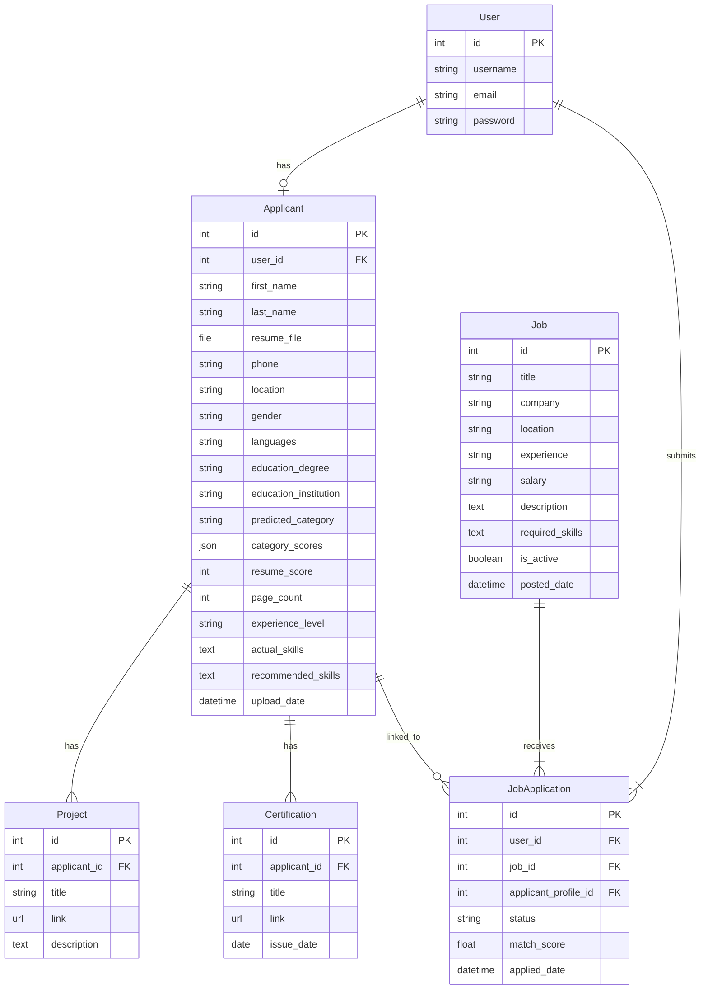

# 🤖 AI-Based Resume Shortlisting and Job Recommendation System

<div align="center">


**An intelligent recruitment automation platform leveraging Machine Learning and Natural Language Processing to streamline the hiring process.**

[Features](#-key-features) • [Tech Stack](#-technology-stack) • [Installation](#-installation) • [Usage](#-usage) • [API](#-api-endpoints) • [Architecture](#-system-architecture) • [Contributing](#-contributing)

</div>

---

## 📋 Table of Contents

- [Overview](#-overview)
- [Key Features](#-key-features)
- [Technology Stack](#-technology-stack)
- [System Architecture](#-system-architecture)
- [Database Schema](#-database-schema)
- [Installation](#-installation)
- [Usage](#-usage)
- [Project Structure](#-project-structure)
- [ML Model Details](#-ml-model-details)
- [API Endpoints](#-api-endpoints)
- [Screenshots](#-screenshots)
- [Ethical AI & Bias Mitigation](#-ethical-ai--bias-mitigation)
- [Future Roadmap](#-future-roadmap)
- [Contributing](#-contributing)
- [License](#-license)

---

## 📖 Overview

The **AI-Based Resume Shortlisting and Job Recommendation System** is a production-ready recruitment automation platform designed to revolutionize the hiring process. It combines state-of-the-art Machine Learning techniques with practical HR workflow management to create a seamless experience for both recruiters and job seekers.

### The Problem

Traditional recruitment processes are:
- **Time-consuming**: HR teams spend 30+ hours per week screening resumes manually
- **Inconsistent**: Human bias and fatigue lead to overlooking qualified candidates
- **Inefficient**: Manual skill matching often misses relevant transferable skills

### Our Solution

This platform automates resume analysis using AI to:
- **Parse and categorize resumes** into relevant job categories automatically
- **Extract skills** and match them with job requirements
- **Score resumes** based on content quality, structure, and relevance
- **Recommend jobs** to candidates based on their profile
- **Provide actionable feedback** to help candidates improve their resumes

---

## ✨ Key Features

### For Candidates 👤
| Feature | Description |
|---------|-------------|
| **AI Resume Analysis** | Upload PDF resumes for automatic parsing and category prediction |
| **Multi-Label Classification** | Get matched to multiple relevant job categories with confidence scores |
| **Skill Extraction** | Automatic identification of technical and soft skills from resume |
| **Resume Scoring** | Get a comprehensive score (0-100) based on content, structure, and completeness |
| **Personalized Recommendations** | Receive skill recommendations to improve your profile |
| **Job Matching** | View jobs that match your predicted categories |
| **Application Tracking** | Track status of all your job applications in one place |
| **Profile Management** | Edit personal details, education, projects, and certifications |

### For HR/Recruiters 👔
| Feature | Description |
|---------|-------------|
| **HR Dashboard** | Centralized view of all candidates and applications |
| **Job Posting** | Create and manage job listings with required skills |
| **AI-Powered Screening** | View AI match scores for each applicant |
| **Applicant Management** | Shortlist, reject, or mark candidates as hired |
| **Job Scraping** | Integrated Selenium scraper to fetch real job listings from Naukri |
| **Category Filtering** | Filter applicants by predicted job categories |
| **Experience Level Detection** | Automatically detect Entry/Mid/Senior level candidates |

---

## 🛠 Technology Stack

### Backend
| Technology | Purpose |
|------------|---------|
| **Python 3.10+** | Core programming language |
| **Django 4.2+** | Web framework (MVT pattern) |
| **SQLite/PostgreSQL** | Database (SQLite for dev, PostgreSQL for production) |

### Machine Learning & NLP
| Technology | Purpose |
|------------|---------|
| **Scikit-Learn** | TF-IDF Vectorization, KNN Classification, OneVsRest Classifier |
| **SpaCy** | Named Entity Recognition (NER), Noun Phrase extraction |
| **NLTK** | Text preprocessing and tokenization |
| **Sentence Transformers** | BERT-based semantic similarity for job matching |
| **Pandas & NumPy** | Data manipulation and numerical computing |

### Frontend
| Technology | Purpose |
|------------|---------|
| **HTML5** | Page structure |
| **Bootstrap 5** | Responsive UI components |
| **JavaScript** | Client-side interactivity |

### Tools & Utilities
| Technology | Purpose |
|------------|---------|
| **PyPDF2 / pdfminer** | PDF resume parsing |
| **Selenium** | Web scraping for job listings |
| **Joblib** | Model serialization |
| **Matplotlib & Seaborn** | Training visualization |

---

## 🏗 System Architecture

```
┌─────────────────────────────────────────────────────────────────────────────┐
│                              PRESENTATION LAYER                              │
│  ┌──────────────────────┐    ┌──────────────────────┐    ┌────────────────┐ │
│  │   Candidate Portal   │    │     HR Dashboard     │    │ Landing Page   │ │
│  │  - Resume Upload     │    │  - Job Management    │    │ - Login/Signup │ │
│  │  - Profile Edit      │    │  - Applicant View    │    │ - Features     │ │
│  │  - Job Application   │    │  - Shortlisting      │    │                │ │
│  └──────────────────────┘    └──────────────────────┘    └────────────────┘ │
└─────────────────────────────────────────────────────────────────────────────┘
                                        │
                                        ▼
┌─────────────────────────────────────────────────────────────────────────────┐
│                              APPLICATION LAYER                               │
│  ┌──────────────────────────────────────────────────────────────────────┐   │
│  │                         Django Views & URLs                           │   │
│  │   app/views.py          dashboard/views.py          project_config/  │   │
│  └──────────────────────────────────────────────────────────────────────┘   │
└─────────────────────────────────────────────────────────────────────────────┘
                                        │
                                        ▼
┌─────────────────────────────────────────────────────────────────────────────┐
│                              AI PROCESSING LAYER                             │
│  ┌────────────────────┐    ┌────────────────────┐    ┌───────────────────┐  │
│  │   ResumeParser     │    │    Skill Engine    │    │  Match Calculator │  │
│  │  - PDF Extraction  │    │  - Skill Matching  │    │  - BERT Similarity│  │
│  │  - Text Cleaning   │    │  - NER Extraction  │    │  - Score Compute  │  │
│  │  - TF-IDF Vector   │    │  - Recommendations │    │                   │  │
│  │  - KNN Prediction  │    │                    │    │                   │  │
│  └────────────────────┘    └────────────────────┘    └───────────────────┘  │
└─────────────────────────────────────────────────────────────────────────────┘
                                        │
                                        ▼
┌─────────────────────────────────────────────────────────────────────────────┐
│                                DATA LAYER                                    │
│  ┌────────────────────┐    ┌────────────────────┐    ┌───────────────────┐  │
│  │     Applicant      │    │        Job         │    │  JobApplication   │  │
│  │  - Personal Info   │    │  - Title/Company   │    │  - Status         │  │
│  │  - Resume File     │    │  - Skills Required │    │  - Match Score    │  │
│  │  - AI Predictions  │    │  - Description     │    │  - Applied Date   │  │
│  │  - Skills/Score    │    │                    │    │                   │  │
│  └────────────────────┘    └────────────────────┘    └───────────────────┘  │
└─────────────────────────────────────────────────────────────────────────────┘
```

---

## 📊 Database Schema



---

## 🚀 Installation

### Prerequisites

- Python 3.10 or higher
- pip (Python package manager)
- Git

### Step-by-Step Setup

#### 1. Clone the Repository

```bash
git clone https://github.com/sauravsultane/AI-Based-Resume-Shortlisting-And-Job-Recommendation-System.git
cd AI-Based-Resume-Shortlisting-And-Job-Recommendation-System/AI_Recruitment_Platform
```

#### 2. Create Virtual Environment (Recommended)

```bash
# Windows
python -m venv venv
venv\Scripts\activate

# macOS/Linux
python3 -m venv venv
source venv/bin/activate
```

#### 3. Install Dependencies

```bash
pip install -r requirements.txt
```

#### 4. Download SpaCy Language Model

```bash
python -m spacy download en_core_web_sm
```

#### 5. Initialize Database

```bash
python manage.py makemigrations
python manage.py migrate
```

#### 6. Train the ML Model

```bash
python training/train_model.py
```

This will generate the following artifacts in the `training/` directory:
- `model.pkl` - Trained KNN classifier
- `vectorizer.pkl` - TF-IDF vectorizer
- `encoder.pkl` - Label encoder
- `model_metadata.json` - Model configuration

#### 7. Create Admin/HR User (Optional)

```bash
python manage.py createsuperuser
```

#### 8. Run Development Server

```bash
python manage.py runserver
```

#### 9. Access the Application

- **Home Page**: http://127.0.0.1:8000/
- **Candidate Registration**: http://127.0.0.1:8000/register/
- **HR Dashboard**: http://127.0.0.1:8000/hr/dashboard/
- **Admin Panel**: http://127.0.0.1:8000/admin/

---

## 📁 Project Structure

```
AI-Based-Resume-Shortlisting-And-Job-Recommendation-System/
├── AI_Recruitment_Platform/
│   ├── app/                          # Candidate Application Module
│   │   ├── models.py                 # Applicant, Project, Certification models
│   │   ├── views.py                  # Candidate views (signup, upload, dashboard)
│   │   ├── forms.py                  # Registration and upload forms
│   │   ├── prediction.py             # ResumeParser class (core AI logic)
│   │   ├── scrape_jobs.py            # Selenium job scraper
│   │   └── urls.py                   # Candidate URL routing
│   │
│   ├── dashboard/                    # HR Dashboard Module
│   │   ├── models.py                 # Job, JobApplication models
│   │   ├── views.py                  # HR views (job management, applicants)
│   │   └── urls.py                   # Dashboard URL routing
│   │
│   ├── project_config/               # Django Project Configuration
│   │   ├── settings.py               # Project settings
│   │   └── urls.py                   # Root URL routing
│   │
│   ├── templates/                    # HTML Templates
│   │   ├── base.html                 # Base template
│   │   ├── candidate_base.html       # Candidate portal base
│   │   ├── hr_base.html              # HR portal base
│   │   ├── dashboard.html            # Candidate dashboard
│   │   ├── hr_dashboard.html         # HR dashboard
│   │   └── ...                       # Other templates
│   │
│   ├── static/                       # Static Assets (CSS, JS)
│   │
│   ├── media/                        # User Uploads (Resumes)
│   │
│   ├── dataset/                      # Training Datasets
│   │   ├── Resume.csv                # Main resume dataset
│   │   ├── Resume_Engineering_Only.csv
│   │   └── gpt_dataset.csv           # Augmented dataset
│   │
│   ├── training/                     # ML Training Scripts & Artifacts
│   │   ├── train_model.py            # Model training script
│   │   ├── model.pkl                 # Trained model (generated)
│   │   ├── vectorizer.pkl            # TF-IDF vectorizer (generated)
│   │   └── model_metadata.json       # Model config (generated)
│   │
│   ├── manage.py                     # Django management script
│   └── requirements.txt              # Python dependencies
│
└── README.md                         # This file
```

---

## 🧠 ML Model Details

### Model Architecture

| Component | Details |
|-----------|---------|
| **Vectorization** | TF-IDF (Term Frequency-Inverse Document Frequency) |
| **Classifier** | OneVsRestClassifier with KNeighborsClassifier |
| **Model Type** | Multi-label Classification |
| **Threshold** | 0.3 (configurable) |

### Supported Categories

The model predicts the following job categories:

1. 🖥️ **Backend Developer**
2. ☁️ **Cloud Engineer**
3. 📊 **Data Scientist**
4. 🎨 **Frontend Developer**
5. 🔧 **Full Stack Developer**
6. 🤖 **Machine Learning Engineer**
7. 📱 **Mobile App Developer (iOS/Android)**
8. 🐍 **Python Developer**

### Resume Scoring Algorithm

The resume score (0-100) is calculated based on:

| Factor | Weight | Description |
|--------|--------|-------------|
| Skills Coverage | 30% | Number of relevant skills extracted |
| Education | 20% | Degree and institution presence |
| Experience Indicators | 20% | Years of experience, job titles |
| Projects | 15% | Presence of project descriptions |
| Structure | 10% | Proper sections, formatting |
| Certifications | 5% | Professional certifications listed |

### Feature Engineering

The `ResumeParser` class performs:

1. **Text Cleaning**: 
   - Lowercase transformation
   - URL removal
   - Special character removal
   - PII removal (for bias mitigation)

2. **Skill Extraction**:
   - Dictionary-based matching
   - SpaCy NER for organizations
   - Noun phrase extraction

3. **Experience Level Estimation**:
   - Regex-based year extraction
   - Keyword analysis (Senior, Lead, etc.)
   - Page count validation

---

## 🔌 API Endpoints

### Candidate Endpoints (`/app/`)

| Endpoint | Method | Description |
|----------|--------|-------------|
| `/` | GET | Landing page |
| `/register/` | GET, POST | Candidate registration with resume upload |
| `/login/` | GET, POST | Candidate login |
| `/logout/` | GET | Logout |
| `/dashboard/` | GET | Candidate dashboard |
| `/edit-profile/` | GET, POST | Edit candidate profile |
| `/apply/<job_id>/` | POST | Apply to a job |
| `/my-applications/` | GET | View applied jobs |
| `/available-jobs/` | GET | Browse available jobs |

### HR Dashboard Endpoints (`/hr/`)

| Endpoint | Method | Description |
|----------|--------|-------------|
| `/hr/login/` | GET, POST | HR login |
| `/hr/register/` | GET, POST | HR registration |
| `/hr/dashboard/` | GET | HR dashboard overview |
| `/hr/create-job/` | GET, POST | Create new job posting |
| `/hr/jobs/` | GET | List all jobs |
| `/hr/job/<id>/applicants/` | GET | View applicants for a job |
| `/hr/applicants/` | GET | View all applicants |
| `/hr/applicant/<id>/` | GET | Applicant detail view |
| `/hr/run-scraper/` | POST | Trigger job scraper |

---

## 📸 Screenshots

> Screenshots can be added here to showcase the UI
> 
> - Landing Page
> - Candidate Dashboard
> - HR Dashboard
> - Resume Analysis Results
> - Job Listing Page

---

## ⚖️ Ethical AI & Bias Mitigation

This system is designed with fairness and transparency in mind:

### 1. PII Removal
The `clean_text` function strips potentially biasing information:
- Gender pronouns (he/she)
- Gender markers and titles
- Age indicators

### 2. Skill-Based Evaluation
- Matching is primarily driven by **skill keywords** rather than:
  - University names/rankings
  - Previous employer prestige
  - Demographic indicators

### 3. Explainability
The results page explicitly shows:
- **Actual Skills Detected**: What the AI found in your resume
- **Recommended Skills**: What you could add to improve
- **Score Breakdown**: Why you received your score

### 4. Human-in-the-Loop
- Final hiring decisions remain with HR
- AI provides recommendations, not decisions
- Shortlisting status can be overridden by HR

---

## 🔮 Future Roadmap

| Phase | Feature | Status |
|-------|---------|--------|
| 🚧 | PostgreSQL migration for production | Planned |
| 🚧 | Deep Learning integration (BERT/Transformers) | Planned |
| 🚧 | Email notifications (Celery + Redis) | Planned |
| 🚧 | Video interview scheduling | Planned |
| 🚧 | Resume template suggestions | Planned |
| 🚧 | Analytics dashboard for HR | Planned |
| 🚧 | REST API for third-party integrations | Planned |
| 🚧 | Docker containerization | Planned |

---

## 🤝 Contributing

Contributions are welcome! Please follow these steps:

1. **Fork** the repository
2. Create a **feature branch** (`git checkout -b feature/AmazingFeature`)
3. **Commit** your changes (`git commit -m 'Add some AmazingFeature'`)
4. **Push** to the branch (`git push origin feature/AmazingFeature`)
5. Open a **Pull Request**

### Code Style
- Follow PEP 8 for Python code
- Use meaningful variable and function names
- Add docstrings to functions and classes
- Write unit tests for new features

---

## 📄 License

This project is licensed under the MIT License - see the [LICENSE](LICENSE) file for details.

---

## 👥 Authors

- **Saurav Sultane** - *Initial work* - [GitHub](https://github.com/sauravsultane)
- **Om Autade** - *Initial work* - [GitHub](https://github.com/omautade045)
- **Umesh Shingare** - *Initial work* - [GitHub](https://github.com/umeshshingare)
- **Om Taskar** - *Initial work* - [GitHub](https://github.com/OmTaskar)
- **Kalpesh Wagh** - *Initial work* - [GitHub](https://github.com/kalpeshwagh)

---

## 🙏 Acknowledgements

- [Scikit-Learn](https://scikit-learn.org/) for machine learning tools
- [SpaCy](https://spacy.io/) for NLP capabilities
- [Django](https://www.djangoproject.com/) for the web framework
- [Bootstrap](https://getbootstrap.com/) for UI components
- Resume dataset contributors

---

<div align="center">

**⭐ Star this repo if you find it helpful! ⭐**

Made with ❤️ for smarter recruitment

</div>
